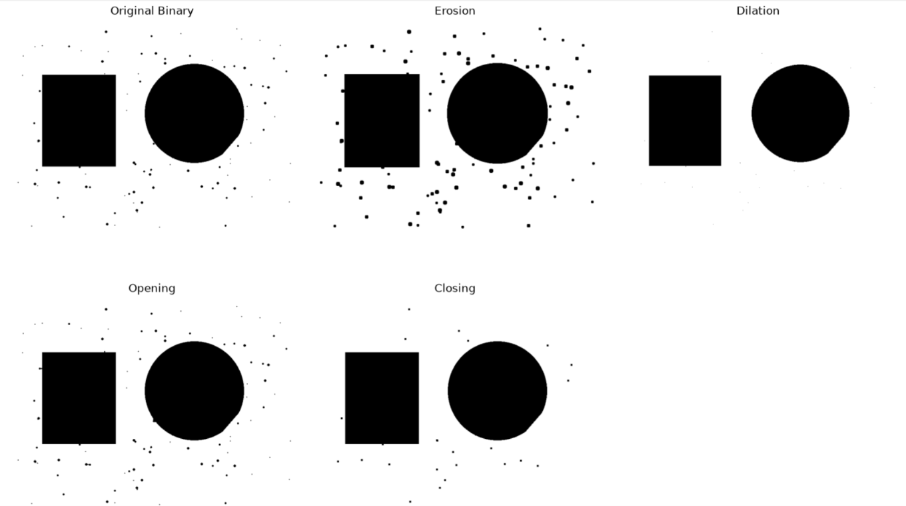
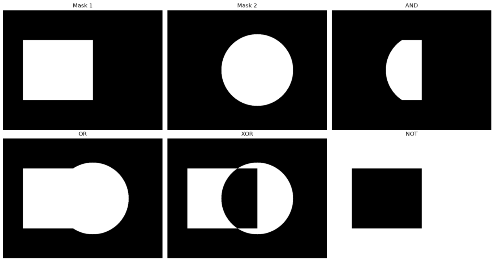
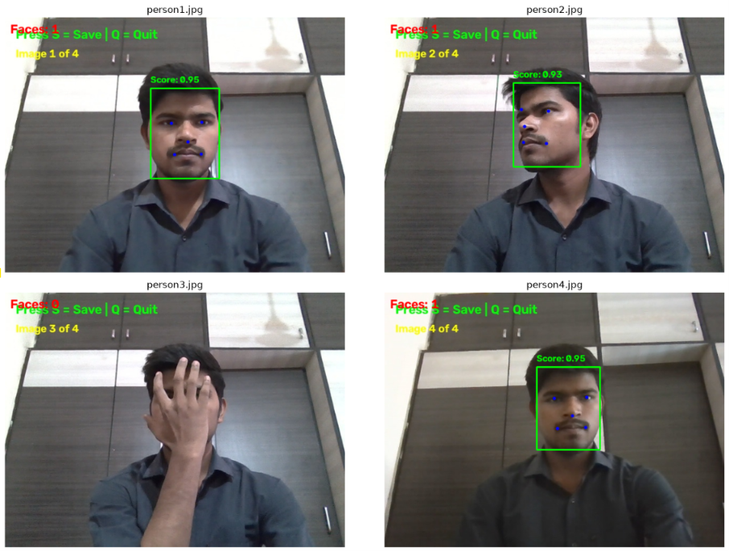
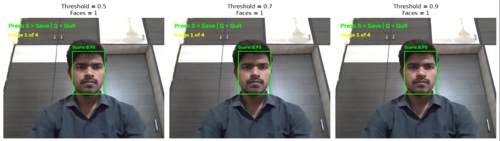
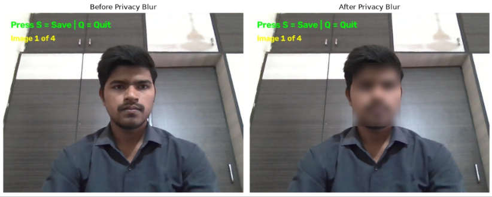
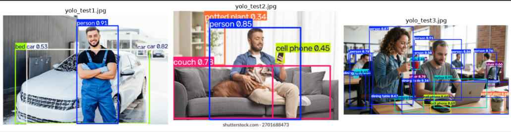

# CV_PR3 - Computer Vision and Deep Learning Pipeline

## Project Overview

This project is a practical Computer Vision and Deep Learning project completed using Python, OpenCV, YuNet, and YOLOv8.

The project starts with classical image-processing techniques and then moves to modern deep-learning-based detection. Finally, YuNet face detection and YOLOv8 object detection are combined into a single real-time webcam pipeline.

### Main Topics

- Morphological image processing
- Bitwise image operations
- Grayscale and colour histograms
- Brightness and contrast adjustment
- YuNet face detection
- Real-time face detection using webcam
- Face privacy blur using Gaussian Blur
- YOLOv8 object detection
- Confidence and IoU threshold experiments
- Per-class object detection summary
- Unified YuNet + YOLOv8 pipeline
- Morphological pre-cleaning
- FPS benchmarking
- Final technique comparison

---

## Technologies Used

| Technology | Purpose |
|---|---|
| Python | Programming language |
| OpenCV | Image processing and computer vision |
| NumPy | Numerical operations |
| Matplotlib | Visualization |
| Pandas | Detection summary |
| YuNet | Face detection |
| YOLOv8 | Object detection |
| Jupyter Notebook | Project implementation |

```

> `yolov8n.pt` is downloaded automatically by Ultralytics when the model is loaded for the first time, if it is not already available locally.

---

## Installation

Install the required Python packages:

```bash
pip install opencv-python==5.0.0.*
pip install opencv-contrib-python==5.0.0.*
pip install ultralytics
pip install matplotlib
pip install numpy
pip install pandas
```

If the OpenCV version available in your environment is different, use a compatible OpenCV version supported by your Python environment.

---

# Tasks Completed

## Task 1 - Morphological Operations

The following operations were implemented:

- Erosion
- Dilation
- Opening
- Closing
- Kernel shape comparison using RECT, ELLIPSE, and CROSS
- Kernel size comparison using 3x3, 5x5, and 9x9 kernels

Morphological opening was also used as a light preprocessing technique for noise removal.

## 1. Morphology



**Summary:** Morphological operations such as erosion, dilation, opening, and closing were applied to process image regions and remove small noise.  
**Result:** Different kernel shapes and sizes were compared to observe their effect on the image.

---

## Task 2 - Bitwise Operations and Histograms

The project includes:

- Bitwise AND
- Bitwise OR
- Bitwise XOR
- Bitwise NOT
- Image masking
- Grayscale histogram
- Colour histogram
- Brightness adjustment
- Contrast adjustment

These operations demonstrate how classical computer vision can be used for image analysis and preprocessing.


## 2. Bitwise Operation



**Summary:** Bitwise AND, OR, XOR, and NOT operations were used to combine and manipulate image regions.  
**Result:** These operations demonstrate how masks can be used for selective image processing.
---

## Task 3 - YuNet Face Detection

YuNet was used for face detection with OpenCV's `FaceDetectorYN` interface.

The project covers:

- Loading the YuNet ONNX model
- Face detection on static images
- Bounding boxes
- Five facial landmarks
- Confidence scores
- Real-time webcam face detection
- Score threshold comparison
- Privacy blur using Gaussian Blur

Example YuNet setup:


## 3. Face Detection



**Summary:** YuNet was used to detect faces and draw bounding boxes with confidence scores and facial landmarks.  
**Result:** The detector can be used for lightweight real-time face detection.


```python
import cv2

detector = cv2.FaceDetectorYN_create(
    "data/models/face_detection_yunet_2023mar.onnx",
    "",
    (img_w, img_h),
    0.9
)

detector.setInputSize((img_w, img_h))
_, faces = detector.detect(img)
```

## 4. Threshold Comparison



**Summary:** YuNet detection was tested using different score thresholds such as 0.5, 0.7, and 0.9.  
**Result:** The experiment shows how changing the threshold can affect the number of detected faces and detection sensitivity.

---


## 5. Face Blur Privacy

Implemented static and real-time face detection using YuNet, including bounding boxes, five facial landmarks, confidence scores, threshold experiments, and privacy blur.



**Summary:** Detected face regions were processed using Gaussian blur to provide a simple privacy-preserving technique.  
**Result:** The face area is blurred while the remaining image stays visible.
---
## Task 4 - YOLOv8 Object Detection

YOLOv8 Nano was used for general object detection.

The project includes:

- Pretrained YOLOv8 model loading
- Static image detection
- Real-time webcam detection
- Confidence threshold experiments
- IoU/NMS threshold experiments
- Per-class detection counting
- Detection summary bar chart

Example:

```python
from ultralytics import YOLO

model = YOLO("yolov8n.pt")

results = model("data/images/yolo_test1.jpg")
result_image = results[0].plot()

```

## 6. YOLO Object Detection



**Summary:** YOLOv8 was used to detect multiple COCO objects with bounding boxes, class names, and confidence scores.  
**Result:** The experiment demonstrates general-purpose real-time object detection.

---

## Task 5 - Integrated Pipeline and Final Comparison

The final pipeline combines:

```text
Webcam Frame
     |
     +--------------------+
     |                    |
     v                    v
   YuNet                YOLOv8
 Face Detection      Object Detection
     |                    |
     +---------+----------+
               |
               v
       Combined Output
```

### Unified Pipeline

- YuNet face boxes are displayed in **green**.
- YOLOv8 object boxes are displayed in **red**.
- YOLOv8 also displays class labels and confidence scores.

### Morphological Pre-cleaning

A light 3x3 morphological opening operation was tested before detection to compare the detection results with and without preprocessing.

### FPS Benchmarking

The project benchmarks:

1. YuNet face detection alone
2. YOLOv8 object detection alone
3. YuNet + YOLOv8 combined pipeline

The same 100-frame webcam sample is used for the three measurements.

---


## Original Image


## Grayscale Image


> Additional screenshots can be added to the `screenshots/` folder after capturing the YuNet webcam output, YOLOv8 output, unified pipeline, and FPS benchmark chart.

---

# Results and Observations

### Classical Computer Vision

Morphological operations, bitwise operations, and histograms are computationally lightweight and are useful for preprocessing, masking, noise removal, and image analysis.

### YuNet

YuNet provides lightweight face detection together with five facial landmarks. It is suitable for real-time face detection applications.

### YOLOv8

YOLOv8 provides general object detection for multiple COCO classes such as person, car, dog, chair, and other supported objects.

### Unified Pipeline

Combining YuNet and YOLOv8 allows the system to detect faces and general objects in the same webcam frame. The combined pipeline requires more computation because both deep-learning models process every frame.

---

# Final Comparison

| Technique | Type | Main Purpose | Typical Use |
|---|---|---|---|
| Morphology | Classical | Noise and shape processing | Image preprocessing |
| Bitwise Operations | Classical | Mask and region operations | Image masking |
| Histograms | Classical | Intensity and colour analysis | Brightness/contrast analysis |
| YuNet | Deep Learning | Face detection | Real-time face detection |
| YOLOv8 | Deep Learning | General object detection | Object detection |
| YuNet + YOLOv8 | Deep Learning Pipeline | Face + object detection | Real-time monitoring |

---

# Conclusion

This project demonstrates a complete progression from classical image processing to deep-learning-based computer vision.

Classical techniques are useful for fast preprocessing and image analysis. YuNet provides lightweight face detection, while YOLOv8 provides general-purpose object detection. Combining both models creates an integrated real-time computer vision pipeline.

The final deployment choice should consider detection quality, FPS, hardware capability, and application requirements. For a low-power edge device, lightweight models such as YuNet and YOLOv8n are suitable starting points. A cloud server can support experiments with larger models or higher input resolutions.

---

# How to Run

1. Open the `CV_PR3` folder in VS Code or Jupyter Notebook.
2. Install the required packages.
3. Make sure the YuNet ONNX model is present in `data/models/`.
4. Make sure the test images are present in `data/images/`.
5. Open `CV_PR3.ipynb`.
6. Run the notebook cells from Task 1 through Task 5 in order.
7. For webcam tasks, allow camera access when requested.
8. Press `Q` in the OpenCV webcam window to stop real-time detection.

---

# Project Information

**Project:** PR-3 Computer Vision and Deep Learning  
**Notebook:** `CV_PR3.ipynb`  
**Main Models:** YuNet and YOLOv8n  
**Frameworks:** OpenCV and Ultralytics  
**Environment:** Python / Jupyter Notebook

---

# License and Educational Use

This repository is intended for academic and educational purposes. The project uses OpenCV and Ultralytics pretrained models and follows the applicable licenses of those components.
